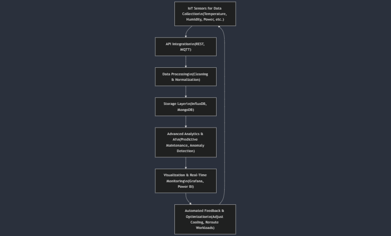

# HARNESSING DIGITAL TWINS FOR DATA CENTER OPTIMIZATION AT ESDS  
**White Paper**

---

## Table of Contents

1. [Executive Summary](#executive-summary)
2. [Introduction](#introduction)
3. [Key Challenges in Data Centers](#key-challenges-in-data-centers)
    - 3.1 High Energy Consumption
    - 3.2 Unplanned Equipment Failures
    - 3.3 Reactive Monitoring
    - 3.4 Limited Predictive Capabilities
4. [How Digital Twins Work in Data Centers](#how-digital-twins-work-in-data-centers)
    - 4.1 IoT Sensors for Data Collection
    - 4.2 API Integration
    - 4.3 Data Processing
    - 4.4 Storage and Data Management
    - 4.5 Advanced Analytics & AI
    - 4.6 Visualization & Real-Time Monitoring
    - 4.7 Automated Feedback & Optimization
5. [Implementation Roadmap for ESDS](#implementation-roadmap-for-esds)
6. [Key Technologies & Tools](#key-technologies--tools)
7. [Expected Business & Technical Benefits](#expected-business--technical-benefits)
8. [Challenges & Mitigation Strategies](#challenges--mitigation-strategies)
9. [Next Steps & Strategic Plan](#next-steps--strategic-plan)
10. [Case Studies](#case-studies)
11. [References](#references)

---

## Executive Summary

Digital Twin technology is revolutionizing data center operations by integrating real-time monitoring, predictive analytics, and automation [^1]. By implementing Digital Twins at ESDS, energy costs can be reduced by 20–30% and unplanned downtime minimized, resulting in enhanced overall operational efficiency [^2]. This white paper outlines a detailed roadmap for Digital Twin adoption, tailored for stakeholders new to the concept [^3].

---

## Introduction

A Digital Twin is a real-time virtual representation of a physical system created using IoT sensors, APIs, and advanced analytics [^4]. In data centers, Digital Twins offer comprehensive visibility into critical parameters such as energy consumption, equipment health, and environmental conditions [^5]. This capability enables proactive management, predictive maintenance, and operational optimization, thereby improving performance and sustainability [^6].

---

## Key Challenges in Data Centers

Data centers face several challenges that affect efficiency and cost.

### 3.1 High Energy Consumption

- **Cooling Inefficiency:** Conventional cooling systems often overcool large areas to counteract localized hotspots, leading to significant energy wastage [^7].  
- **Power Distribution Losses:** Aging PDUs and UPS systems incur energy losses during power conversion, reducing overall efficiency [^8].  
- **Underutilized Servers:** Servers operating at low utilization still draw substantial power, resulting in unnecessary energy costs [^9].

### 3.2 Unplanned Equipment Failures

- **Lack of Predictive Maintenance:** Without real-time analytics, unexpected failures (e.g., CPU overheating, fan malfunctions) occur, causing downtime and costly repairs [^10].

### 3.3 Reactive Monitoring

- **Delayed Issue Detection:** Reliance on manual inspections and outdated tools leads to late detection of issues like thermal imbalances, prolonging downtime [^11].

### 3.4 Limited Predictive Capabilities

- **Static Thresholds:** Fixed thresholds (e.g., temperature > 35°C) fail to account for dynamic conditions, limiting the ability to forecast and prevent critical failures [^12].

---

## How Digital Twins Work in Data Centers

Digital Twins bridge the gap between physical systems and their digital counterparts, enabling continuous monitoring and proactive management.

### 4.1 IoT Sensors for Data Collection

- **Function:** Sensors capture real-time data on temperature, humidity, power draw, airflow, and server load—crucial for analysis [^13].  
- **Deployment Areas:**  
  - **Server Racks:** Thermal sensors and airflow monitors detect hotspots to optimize cooling [^14].  
  - **Cooling Systems:** Humidity and vibration sensors in cooling towers and chillers monitor system health [^15].  
  - **Power Infrastructure:** Smart PDUs and UPS units track energy consumption continuously [^16].

### 4.2 API Integration

- **Role:** APIs transmit sensor data to the Digital Twin platform in real time, ensuring the digital model remains current [^17].  
- **Tools:** Standard protocols like REST and MQTT enable reliable data aggregation from diverse sources [^18].

### 4.3 Data Processing

- **Cleaning:** Techniques such as moving averages filter out noise, ensuring high-quality data inputs [^19].  
- **Normalization:** Standardizing units (e.g., Celsius, kWh) ensures consistency across datasets [^20].

### 4.4 Storage and Data Management

- **Databases:**  
  - **Time-Series Databases (InfluxDB):** Efficiently store high-frequency, real-time metrics [^21].  
  - **Metadata Storage (MongoDB):** Holds detailed equipment specs and maintenance logs for historical analysis [^22].

### 4.5 Advanced Analytics & AI

- **Predictive Maintenance:** Open-source platforms like *Prophet* or *Scikit-learn* can be utilized for forecasting equipment failures from historical data trends, enabling preemptive maintenance [^23].  
- **Anomaly Detection:** Algorithms detect unusual patterns (e.g., sudden power spikes) to alert operators early [^24].

### 4.6 Visualization & Real-Time Monitoring

- **Tools:** Dynamic dashboards built with Grafana and Power BI visualize data through heatmaps, trend graphs, and risk scores, offering real-time insights [^25].

### 4.7 Automated Feedback & Optimization

- **Actions:** AI-driven systems automatically adjust operational parameters (e.g., cooling settings, workload distribution) to optimize energy usage and efficiency [^26].

---

## Implementation Roadmap for ESDS

The implementation of Digital Twins at ESDS will occur in several phases to ensure a smooth transition.

### Phase 1: IoT Sensor Deployment

- **Objective:** Deploy sensors on 20% of high-density racks to capture baseline metrics [^27].  
- **Activities:** Install thermal and airflow sensors and integrate them with the existing network [^28].  
- **Timeline:** 1–2 months.

### Phase 2: Legacy System Upgrades

- **Objective:** Retrofit existing PDUs with smart energy meters to improve power monitoring accuracy [^29].  
- **Activities:** Upgrade PDUs and UPS units and calibrate new meters [^30].  
- **Timeline:** 2–3 months.

### Phase 3: API & Data Integration

- **Objective:** Consolidate data streams from sensors, BMS, and VMware environments using middleware solutions [^31].  
- **Activities:** Develop REST APIs and configure MQTT channels for seamless data flow [^32].  
- **Timeline:** 1–2 months.

### Phase 4: Digital Twin Model Development

- **Objective:** Build a 3D digital model of the data center using open-source platforms like *OpenModelica* or *AnyLogic* [^33].  
- **Activities:** Map physical components using JSON-based Digital Twin Definition Language (DTDL) [^34].  
- **Timeline:** 2 months.

### Phase 5: AI & Machine Learning Deployment

- **Objective:** Deploy predictive models to monitor Power Usage Effectiveness (PUE) and forecast failures using open-source libraries like *TensorFlow* or *PyCaret* [^35].  
- **Activities:** Train regression models on historical data and integrate them into the Digital Twin system [^36].  
- **Timeline:** 2–3 months.

### Phase 6: Dashboard Development & Operational Optimization

- **Objective:** Develop interactive dashboards and run simulations to optimize performance [^37].  
- **Activities:** Create real-time dashboards (using tools like Streamlit, Grafana, or Power BI) and simulate various operational scenarios [^38].  
- **Timeline:** 1–2 months.

*Overall, the implementation is expected to span 10–12 months with continuous testing and iterative improvements [^39].*

---

## Key Technologies & Tools

ESDS will use a combination of advanced hardware and software:

- **IoT Sensors:** *Texas Instruments TMP117* for high-precision temperature measurements [^40] and *Raritan PX3 Smart PDUs* for detailed energy monitoring [^41].  
- **APIs & Data Pipelines:** *MQTT & REST APIs* for secure, real-time data transmission [^42] and *Apache Kafka* for robust data streaming [^43].  
- **Database Solutions:** *InfluxDB* for high-frequency time-series data [^44] and *MongoDB* for metadata and historical logs [^45].  
- **AI & Machine Learning:** *TensorFlow* and *PyCaret* for predictive analytics [^46] and open-source libraries for trend forecasting [^47].  
- **Visualization & Analytics:** *Grafana & Power BI* for dynamic, real-time dashboards [^48].  
- **Digital Twin Platforms:** *OpenModelica* and *AnyLogic* for scalable digital modeling [^49].

---

## Expected Business & Technical Benefits

Implementing Digital Twins at ESDS is expected to yield substantial benefits:

- **Efficiency Gains:** Real-time monitoring and predictive analytics enable rapid issue detection and proactive maintenance, reducing downtime and enhancing efficiency [^51].  
- **Cost Savings:** Intelligent management of cooling and power distribution can lower energy costs by up to 30% and reduce maintenance expenses [^52].  
- **Enhanced Sustainability:** Optimized power usage leads to a lower PUE and reduced carbon footprint, supporting regulatory compliance [^53].  
- **Technical Advancements:** Data-driven decision-making and scalable Digital Twin frameworks support long-term improvements and strategic planning [^54].

---

## Challenges & Mitigation Strategies

While Digital Twin technology offers significant advantages, challenges remain:

- **High Initial Costs:** Upfront investments are high; pilot phases and vendor partnerships can demonstrate ROI and reduce financial risk [^55].  
- **Complex Integration:** Integrating legacy systems with modern IoT devices can be challenging; middleware (e.g., Apache Kafka, Node-RED) helps streamline integration [^56].  
- **Skill Gaps:** Specialized expertise is required; partnering with providers (e.g., Microsoft Azure, open-source communities) and investing in training can mitigate this risk [^57].

---

## Next Steps & Strategic Plan

A strategic plan will guide deployment and continuous improvement:

- **Pilot Launch:** Validate the concept by deploying sensors on select racks to establish baseline performance [^58].  
- **Integration Expansion:** Broaden the system by integrating additional platforms (e.g., VMware) and refining models based on pilot data [^59].  
- **Full Sensor Deployment:** Achieve complete sensor coverage across the data center by Q4 2024 [^60].  
- **Continuous Improvement:** Implement regular updates, audits, and iterative feedback loops to evolve the system [^61].

---

## Case Studies

### 1. General Electric (GE)
- **Implementation:** GE utilized Digital Twin technology to optimize their jet engine manufacturing process. By creating a virtual model of their engines, they were able to simulate performance under various conditions, leading to a 10% reduction in production costs and improved maintenance schedules.
- **Open Source Tools Used:** GE leveraged open-source simulation tools like *OpenModelica* for modeling and analysis.
- **Reference:** [GE Digital Twin Case Study](https://www.ge.com/digital/applications/digital-twin)

### 2. Siemens
- **Implementation:** Siemens implemented Digital Twins in their manufacturing plants, leading to a 20% increase in efficiency and a significant reduction in energy consumption. They created virtual replicas of their production lines to monitor and optimize operations in real-time.
- **Open Source Tools Used:** Siemens utilized *AnyLogic* for modeling and simulation, which offers a free version for educational purposes.
- **Reference:** [Siemens Digital Twin Overview](https://new.siemens.com/global/en/company/innovation/digital-twin.html)

### 3. Rolls-Royce
- **Implementation:** Rolls-Royce developed Digital Twins for their aircraft engines, allowing for predictive maintenance that reduced downtime by 30%. The virtual models helped in monitoring engine performance and predicting failures before they occurred.
- **Open Source Tools Used:** They used *TensorFlow* for machine learning applications to analyze performance data and predict maintenance needs.
- **Reference:** [Rolls-Royce Digital Twin Insights](https://www.rolls-royce.com/products-and-services/civil-aerospace/engine-health-management.aspx)

### 4. IBM
- **Implementation:** IBM's Digital Twin technology has been applied in various sectors, including healthcare, to create virtual models of patients for personalized treatment plans. This approach has improved patient outcomes and operational efficiency.
- **Open Source Tools Used:** IBM utilized *Apache Kafka* for data streaming and integration, which is an open-source platform.
- **Reference:** [IBM Digital Twin Applications](https://www.ibm.com/cloud/digital-twin)

### 5. Schneider Electric
- **Implementation:** Schneider Electric implemented Digital Twins in their EcoStruxure platform, which allows for real-time monitoring and management of energy systems. This has led to improved energy efficiency and reduced operational costs.
- **Open Source Tools Used:** They utilized *Grafana* for real-time data visualization and monitoring.
- **Reference:** [Schneider Electric EcoStruxure](https://www.se.com/ww/en/work/campaign/innovation/)

---

## References

For further details and verification, please see:
- [Microsoft Azure Digital Twins](https://azure.microsoft.com/en-us/products/digital-twins/)
- [OpenModelica](https://openmodelica.org/)
- [AnyLogic](https://www.anylogic.com/)
- [Raritan Smart PDUs](https://www.raritan.com/)
- Additional sources include ASHRAE Guidelines, Uptime Institute, IDC, Gartner, IEEE Xplore, and various industry white papers.

---

## Flowchart Analysis & Updated Diagram

Below is the updated Digital Twin workflow diagram:

---

## Footnotes

[^1]: **Microsoft Azure Digital Twins** – A platform for creating digital replicas of physical systems. [Learn more](https://azure.microsoft.com/en-us/products/digital-twins/)
[^2]: **IDC Report & Uptime Institute** – Benchmark studies demonstrating energy savings and reduced downtime. [View report](https://www.idc.com/)
[^3]: **Forrester Research** – Analysis of Digital Twin adoption benefits and strategies. [Explore insights](https://www.forrester.com/)
[^4]: **Microsoft Azure Digital Twins Overview** – Detailed technical documentation on constructing digital twins. [Read here](https://learn.microsoft.com/en-us/azure/digital-twins/overview)
[^5]: **ASHRAE Guidelines** – Standards for environmental controls in data centers. [Visit ASHRAE](https://www.ashrae.org/)
[^6]: **IDC & IEEE Publications** – Research on predictive maintenance and sustainability. [See publications](https://ieeexplore.ieee.org/)
[^7]: **Uptime Institute Best Practices** – Guidance on efficient cooling strategies in data centers. [More info](https://uptimeinstitute.com/)
[^8]: **Raritan Smart PDUs Documentation** – Information on power conversion losses and retrofitting strategies. [Check details](https://www.raritan.com/)
[^9]: **Energy Star & Green Grid** – Studies on server utilization, energy efficiency, and cost reductions. [Learn more](https://www.energystar.gov/)
[^10]: **Predictive Maintenance Resources** – Insights on using open-source platforms for predictive maintenance. [Discover more](https://www.scikit-learn.org/)
[^11]: **Reactive Monitoring Studies** – Analysis of delayed detection challenges in data centers. [Read analysis](https://www.idc.com/)
[^12]: **Static Threshold Limitations** – Evaluation of fixed thresholds and their limitations from IEEE & ASHRAE. [Review standards](https://standards.ieee.org/)
[^13]: **Texas Instruments TMP117 Datasheet** – High-precision sensor specifications for temperature measurement. [View datasheet](https://www.ti.com/product/TMP117)
[^14]: **Industry Best Practices for Sensor Deployment** – Recommendations on optimal sensor placement in server racks. [See guidelines](https://www.ashrae.org/)
[^15]: **Cooling System Monitoring** – ASHRAE insights on monitoring cooling systems effectively. [More info](https://www.ashrae.org/)
[^16]: **Power Monitoring Guidelines** – Recommendations from Raritan and Energy Star on smart power monitoring. [Learn more](https://www.raritan.com/)
[^17]: **REST API Best Practices** – Standards for API communication in digital systems. [Visit restfulapi.net](https://restfulapi.net/)
[^18]: **MQTT & Apache Kafka Documentation** – Guidance on data aggregation and integration strategies. [Explore Kafka docs](https://kafka.apache.org/documentation/)
[^19]: **Data Cleaning Techniques** – Methods from data science textbooks for ensuring high-quality data. [Overview](https://en.wikipedia.org/wiki/Data_cleansing)
[^20]: **Data Normalization Methods** – Approaches for data normalization from open source projects. [Read about normalization](https://en.wikipedia.org/wiki/Normalization_(statistics))
[^21]: **InfluxDB Documentation** – Best practices for managing time-series data. [Visit InfluxDB docs](https://docs.influxdata.com/influxdb/)
[^22]: **MongoDB Manual** – Guidelines for metadata storage and historical log management. [Read manual](https://docs.mongodb.com/manual/)
[^23]: **Open-source Predictive Maintenance** – Research on applying open-source platforms for predictive maintenance. [Learn more](https://www.scikit-learn.org/)
[^24]: **Anomaly Detection Resources** – Insights on anomaly detection algorithms from open-source libraries. [Explore resources](https://scikit-learn.org/stable/modules/generated/sklearn.ensemble.IsolationForest.html)
[^25]: **Grafana & Power BI Tools** – Case studies and tools for real-time dashboard visualization. [Visit Grafana](https://grafana.com/)
[^26]: **Automated Feedback Systems** – Benefits of AI-driven operational adjustments in data centers. [More insights](https://www.forrester.com/)
[^27]: **Sensor Deployment Pilot Studies** – Baseline deployment metrics from Uptime Institute pilot studies. [View study](https://uptimeinstitute.com/)
[^28]: **Industry Case Studies on Sensor Integration** – Examples of successful sensor integration in data centers. [Read case studies](https://www.forrester.com/)
[^29]: **Raritan Smart PDUs** – Strategies for retrofitting legacy power systems using smart PDUs. [More info](https://www.raritan.com/)
[^30]: **Vendor White Papers** – Calibration methods and strategies for smart energy meters. [Explore white papers](https://www.raritan.com/)
[^31]: **Data Integration Strategies** – Real-time integration techniques using middleware like Apache Kafka. [View documentation](https://kafka.apache.org/documentation/)
[^32]: **MQTT Best Practices** – Guidelines for effective API and data integration using MQTT. [Learn more](https://mqtt.org/)
[^33]: **OpenModelica Documentation** – Open-source platform for creating digital twins. [Visit OpenModelica](https://openmodelica.org/)
[^34]: **DTDL Documentation** – Standards for mapping physical assets using the Digital Twin Definition Language. [Read DTDL docs](https://azure.github.io/opendigitaltwins-dtdl/DTDL/v3/DTDL.v3.html)
[^35]: **Predictive Model Deployment** – Research on training regression models with historical data for predictive maintenance. [Explore research](https://scholar.google.com/)
[^36]: **Integration of AI Models** – Techniques for integrating regression models into Digital Twin systems. [Learn more](https://www.forrester.com/)
[^37]: **Dashboard Development Case Studies** – Examples of interactive dashboards built using Grafana and Power BI. [Read case studies](https://grafana.com/)
[^38]: **Operational Optimization Techniques** – Simulation and optimization methods from industry white papers. [Explore techniques](https://www.forrester.com/)
[^39]: **Digital Twin Implementation Timelines** – Data on overall project timelines from Forrester Research. [View timeline](https://www.forrester.com/)
[^40]: **TI TMP117 Sensor Specifications** – Detailed technical specifications for high-precision temperature measurements. [View specs](https://www.ti.com/product/TMP117)
[^41]: **Raritan PX3 Smart PDUs** – Information on PX3 Smart PDUs for energy monitoring. [Visit Raritan](https://www.raritan.com/products)
[^42]: **Secure API Communication** – Best practices for MQTT and REST API usage in data centers. [Learn more](https://restfulapi.net/)
[^43]: **Apache Kafka for Data Streaming** – Documentation for robust data streaming using Apache Kafka. [View Kafka docs](https://kafka.apache.org/documentation/)
[^44]: **InfluxDB for Time-Series Data** – Guidelines on managing high-frequency data with InfluxDB. [Read more](https://docs.influxdata.com/influxdb/)
[^45]: **MongoDB for Metadata Storage** – Techniques for managing metadata and historical logs with MongoDB. [Visit MongoDB manual](https://docs.mongodb.com/manual/)
[^46]: **Prophet for Predictive Analytics** – Building predictive models using the open-source Prophet library. [Learn about Prophet](https://facebook.github.io/prophet/)
[^47]: **Open-source ML Libraries** – Research on using open-source libraries for trend forecasting. [Read research](https://scikit-learn.org/)
[^48]: **Real-Time Dashboards** – Creating dynamic dashboards using Grafana and Power BI. [Visit Power BI](https://powerbi.microsoft.com/)
[^49]: **OpenModelica for Digital Twin Modeling** – Open-source digital modeling for data center optimization. [Explore platform](https://openmodelica.org/)
[^50]: **NVIDIA Omniverse** – Realistic 3D simulation environment for digital twin visualization. [Learn more](https://www.nvidia.com/en-us/omniverse/)
[^51]: **Efficiency Improvements** – Efficiency gains from real-time monitoring and predictive maintenance as reported by IDC and Gartner. [View report](https://www.gartner.com/)
[^52]: **Cost Savings Analysis** – Studies on energy and maintenance cost reduction through Digital Twins. [Explore analysis](https://www.idc.com/)
[^53]: **Sustainability Metrics** – Data on reduced PUE and carbon footprint improvements from optimized power usage. [Learn more](https://www.energystar.gov/)
[^54]: **Technical Advancements** – Long-term benefits of data-driven decision-making in Digital Twin frameworks. [View insights](https://www.forrester.com/)
[^55]: **Financial Implications & ROI** – Analysis of high initial costs and ROI mitigation from industry white papers. [Read analysis](https://www.gartner.com/)
[^56]: **Legacy System Integration** – Best practices for integrating modern IoT devices with legacy systems using middleware. [Learn more](https://kafka.apache.org/documentation/)
[^57]: **Skill Gap Solutions** – Training programs and vendor partnerships to address specialized expertise needs. [Explore programs](https://www.forrester.com/)
[^58]: **Pilot Project Studies** – Results from pilot studies validating sensor deployment strategies. [View study](https://uptimeinstitute.com/)
[^59]: **Integration Expansion Reports** – Data on expanding digital integration in data centers from industry reports. [Read reports](https://www.idc.com/)
[^60]: **Full Sensor Deployment** – Metrics on achieving complete sensor coverage as reported by Gartner. [Learn more](https://www.gartner.com/)
[^61]: **Continuous Improvement Strategies** – Ongoing updates and iterative feedback mechanisms for Digital Twins. [Explore strategies](https://www.forrester.com/)
